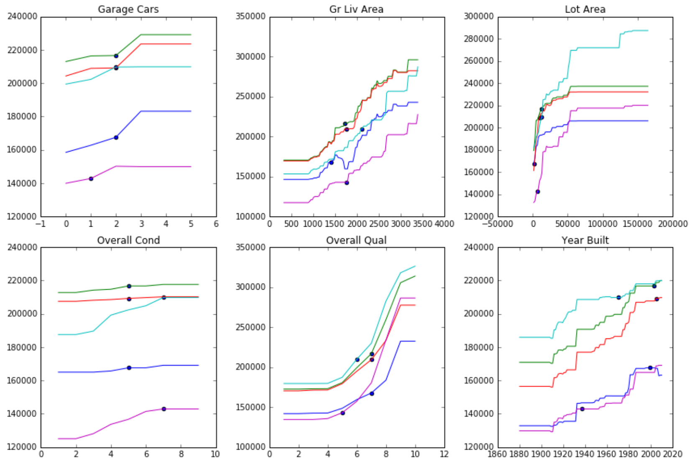

## ML Insights

Welcome to ML-Insights!

This is a package to understand supervised ML Models.  This package has been tested with Scikit-Learn and XGBoost library.  It should work with any machine learning library that has a `predict` and `predict_proba` methods for regression and classification estimators.

There are currently two main sets of capabilities of this package.  The first is around understanding "black-box" models
via the "Model X-Ray".  The second is for probability calibration.

## Model Interpretation

For understanding black-box models, the main entry point is the `ModelXRay` class.  Instantiate it with the model and data.  The data can be what the model was trained with, but intended to be used for out of bag or test data to see how the model performs when one feature is changed, holding everything else constant.

    >>> import ml_insights as mli
    >>> xray = mli.ModelXRay(model, data.sample(500))
    >>> xray.feature_dependence_plots()

Find more detailed examples here:
[https://github.com/numeristical/introspective/tree/master/examples](https://github.com/numeristical/introspective/tree/master/examples)

## Probability Calibration

For probability calibration, the main class is the `SplineCalibratedClassifierCV`.  Using this class you can train your
base model, and the corrective calibration function with just a couple of lines of code.  See the examples by following
the link below.

    >>> rfm = RandomForestClassifier(n_estimators = 500, class_weight='balanced_subsample')
    >>> rfm_cv = mli.SplineCalibratedClassifierCV(rfm)
    >>> rfm_cv.fit(X_train,y_train)
    >>> test_res_calib_cv = rfm_cv.predict_proba(X_test)[:,1]
    >>> log_loss(y_test,test_res_calib_cv)

Find more detailed examples here:
[https://github.com/numeristical/introspective/tree/master/examples](https://github.com/numeristical/introspective/tree/master/examples)

## Other Documentation

[https://ml-insights.readthedocs.io](https://ml-insights.readthedocs.io)

Disclaimer
==========

We have tested this tool to the best of our ability, but understand that it may have bugs.  It was developed on Python 3.5, so should work better with Python 3 than 2.  Use at your own risk, but feel free to report any bugs to our github. <https://github.com/numeristical/introspective>

Installation
=============

    $ pip install ml_insights

Source
======

Find the latest version on github: https://github.com/numeristical/introspective

Feel free to fork and contribute!

License
=======

Free software: `MIT license <LICENSE>`_

Developed By
============

- Brian Lucena
- Ramesh Sampath

References
==========

Alex Goldstein, Adam Kapelner, Justin Bleich, and Emil Pitkin. 2014. Peeking Inside the Black Box: Visualizing Statistical Learning With Plots of Individual Conditional Expectation. Journal of Computational and Graphical Statistics (March 2014)
